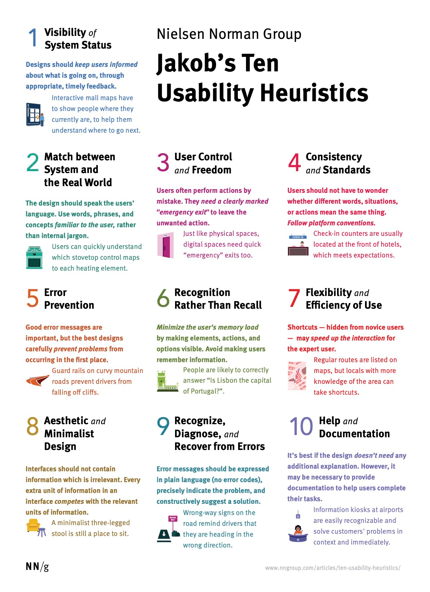
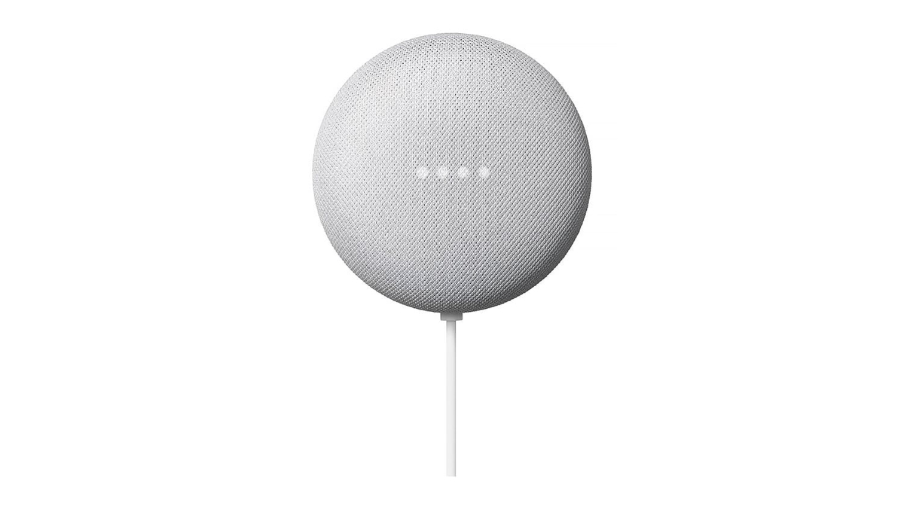
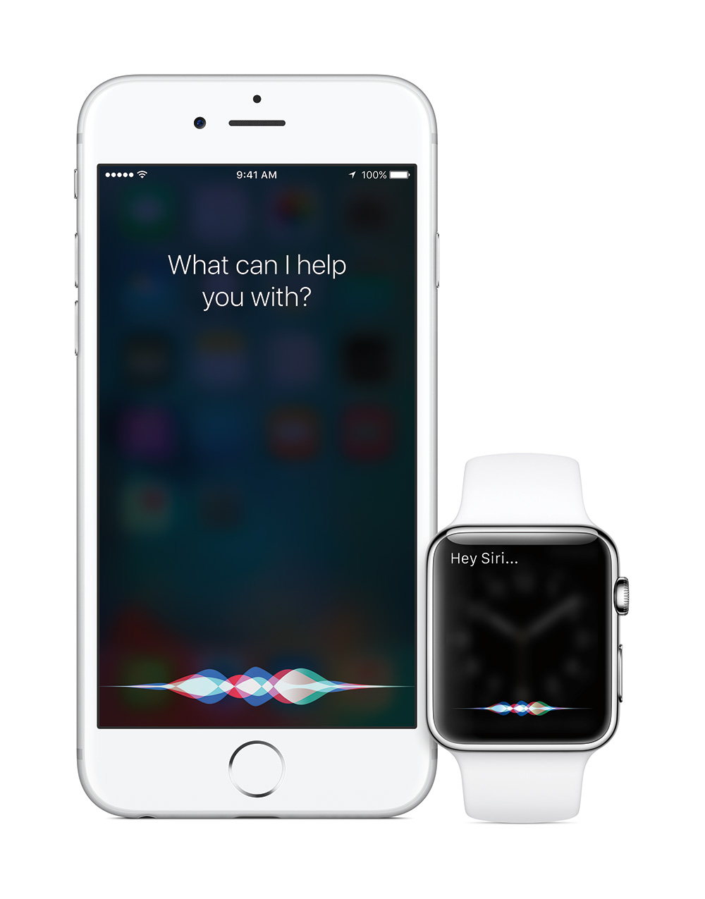
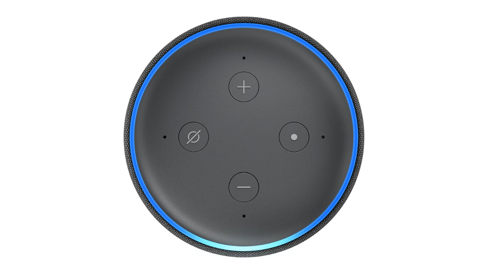
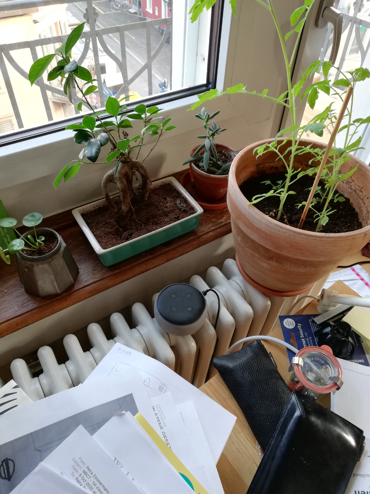
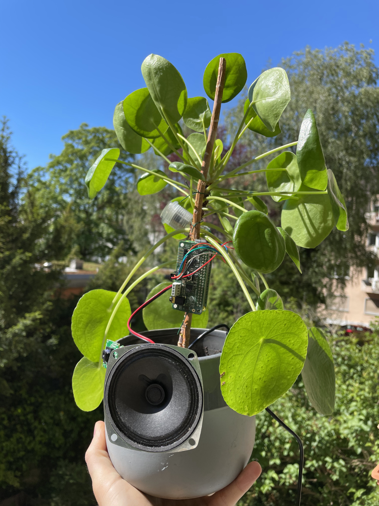
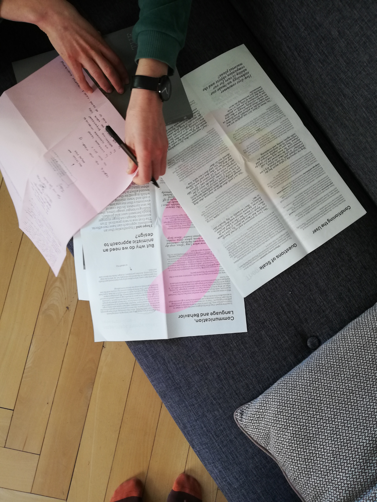
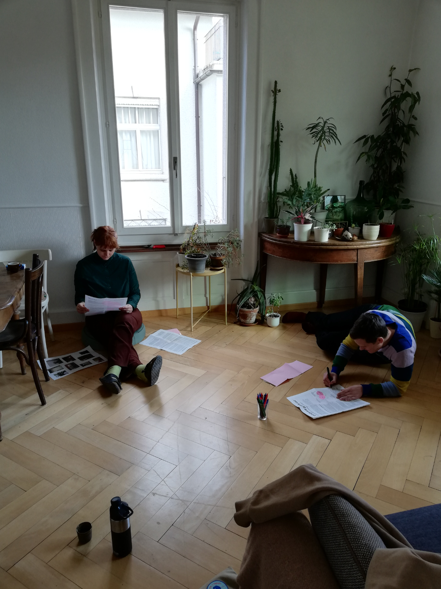
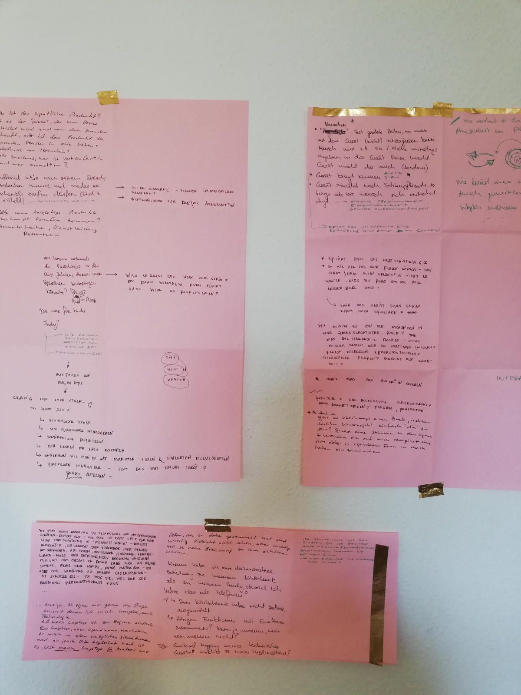
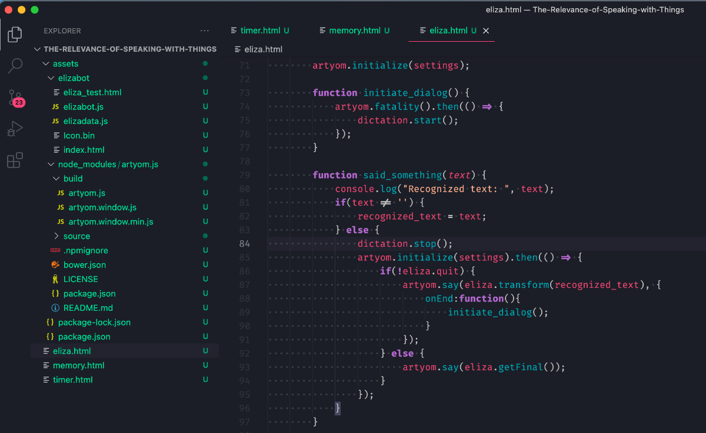

# Talking (to) Things
## A comparative exploration of voice assistants as assistive technologies for blind people

**Adrian Demleitner**
Berner Fachhochschule
Hochschule der Künste Bern
MA Thesis Design Research 2022

## 1. Introduction
This research proposal explores the potentials of voice assistant technologies for the blind[^34], the extent to which this technology can provide and assist access to the world, and how their design could be improved to serve the specific needs of the target demographic and avoid risky situations.

Blind people are increasingly adopting voice assistants (VA) despite being a relatively young technology. This adoption is happening on an informal basis, unmitigated by established processes of learning and funding assistive technologies (AT). Despite not being designed as ATs, this adoption points to potentials for VAs as assistive technologies. Since none of the quality-assuring processes come into effect, this process also brings risks, which need to be assessed by research.

The proposed research project is a comparative study that extends into a prototyping phase. The general approach is human-centered design with a heavy leaning on ontological design. In the first phase, ethnographic methods are applied to study and compare traditional assistive technologies for blind people versus voice assistants for the same set of tasks. These tasks include information retrieval, online shopping, and interaction with computational systems. The given focus is set by the ongoing digitalization of society that centers on the need and considerations of accessibility in all digital processes.

The data collected serves as a baseline for a second phase in which workshops and prototyping occur. The underlying framework for this phase is based on a *universal design* approach, which "is the design and composition of an environment so that it can be accessed, understood and used to the greatest extent possible by all people regardless of their age, size, ability or disability" [@WhatUniversalDesign2021].

The findings will be disseminated in lectures, peer-reviewed journals, workshops, and an open-source published guide for designing and adopting voice assistants for blind people. The guide is produced for interested parties, especially designers, developers, and institutions actively working with blind people.

### 1.1 Thanks
I want to thank my mentors, who put up with my wandering mind, Prof. Dr. Minou Afzali, Prof. Thomas Amberg, and my former coaches Dr. phil. Laura Coppens and Prof. Robert Lzicar. I am forever in debt for your guidance and wisdom.

Further thanks for the inspiring, insightful, and sometimes wild discussions go to Dr. Betti Marenko, transdisciplinary theorist on design and technology; Dr. Anne Stefanie Aronsson, socio-cultural anthropology and STS at the University of Bern; and Alexa Steinbrück, design researcher at XLAB/Lab.

### 1.2 Declaration
I declare that the present work is the result of my personal research and is solely my own work and that I did not use any literature or resources other than those indicated. Verbatim or non-verbatim citations are all marked, and their origin is specified in respect of their bibliographical procedures.

Terms in italic are expanded upon in the glossary.

### 1.3 Initial Situation 
I have been working for a good 20 years as a software developer and just recently finished participating in a research project on the recycling of electronic technologies. My experience gave me a good overview of the possibility and the status quo of consumer electronics. I started this research endeavor from an ecological consideration of the current state of electronic and digital technologies. From my limited but experienced view, the cost-benefit ratio in terms of ecological impact was not given when looking at the value brought forward by consumer electronics and what it costs the planet.

To approach the problem during my MA studies, I choose a relatively young technology to test a specific design approach. I tried to apply *emotionally durable design* (EDD) to voice assistants. *EDD* is interested in our relations to products and forming strong bonds with them. During my studies, I expanded this approach into a broader framework. Next to emotionally durable design, I added object and thing theory, *actor-network theory* (ANT), and *ontological design* to my theoretical repertoire. My initial idea was to incorporate *EDD* and ANT into voice assistants and test such an approach's effects.

A significant flaw of this process was to solely focus on the human-machine relation, leaving out the responsibility of big tech companies. This focus made the research endeavor unfeasible. I abandoned the initial goal, a more ecological approach to tech, as such an approach could not be shouldered by the consumers alone without taking Google, Amazon and Apple (GAFA) into responsibility.

Instead, I stayed within the given scale of human-machine interaction focused on voice assistants and searched for a research gap with social relevance. The second round of interviews brought up interesting tensions on how blind people adopt voice assistants despite not being designed with them in mind.

This research direction aligned very well with the groundwork done so far as this application of voice assistants as assistive devices can be regarded from a position of ontological design. I have already researched their adoption, application, and effects within the entertainment industry and home automation domain and analyzed their effects on people and social situations.

With the newfound focus on the adoption of voice assistants by blind people, questions arose. What makes contemporary voice assistants attractive to blind people? Moreover, how can we ensure that these technologies are up to the task of being of existential importance? What can we learn from the design and implementation of traditional but comparative assistive technologies, like screen readers and voice recognition software?

## 2. State of Research
The following chapter is dedicated to aspects and areas that this research proposal touches on and is touched by. The insights presented were gained mainly through a preliminary literature review and partially through interviews, I could conduct with experts.

> Assistive technology enables and promotes inclusion and participation, especially of persons with disability, aging populations, and people with non-communicable diseases. [@AssistiveTechnology2021]

Assistive technologies help maintain and improve a person's independence and thus increase their wellbeing. They enable people to live following their own will and to participate in the world. ATs are essential technologies for people with impairments. All blind people are dependent on a diverse array of ATs in various contexts. Generally, users of ATs report a relatively positive level of quality of life [@rosnerEffectUsageComputerBased2018] through and with the help of these technologies.

The landscape of assistive technologies for blind people is quite diverse, with digital and physical products to aid in daily life. For brevity, I will concentrate on technologies relevant to the focus of this proposal, which are technologies that mediate access to computational resources. These can be roughly put into two different categories, equating to input and output. Voice recognition software takes over the task to recognize the intentions of the user and translate voice user inputs into action that the computer can execute. On the other hand, screen readers tell the user what is currently *visible* and possible in terms of actions. [@AssistiveTechnologyProducts2021]

Smartphones introduced a whole new array of problematic situations for blind people. In terms of human-computer interaction, the main difference is the omission of a tactile user interface through keyboard and mouse. They got replaced by interaction through a flat touch screen within the context of a smartphone. This omission of physical cues regarding computational input removed control from blind users. Apple was one of the first companies to tackle this problem through its VoiceOver application[^35]. This head-start led to the situation that iPhones are favorites of blind users. VoiceOver is a screen-reader and essentially describes what is currently under the finger. In 2011 Apple also introduced Siri, a virtual voice-based assistant, for iPhones. Voice assistants are essentially a merger of screen readers and voice recognition software.

They differ in a crucial aspect of human-computer interaction. Whereas traditional assistive technologies for the blind are secondary interfaces, voice assistants have first-class access to computational information. 

Screen readers live on top of screens, which is an additional level of complexity regarding interaction. Websites and applications are first designed for a screen. Screen readers then need to tap into the source code, in the case of websites, use assistive *APIs* to read the label of buttons or even apply computer vision techniques to decipher what is on the screen. Only then can the content be prepared for blind users. Screen readers thus need to apply various strategies to interpret visual interfaces. [@senjamSmartphonesBasedAssistiveTechnology2021]

By design, voice assistants directly access the information behind the interfaces. They omit the interpretive layer and translate input and output directly from the information layer. Instead of having physical controls through keyboard or touch, controls are enacted through voice commands and are embedded in the same medial layer as the content. This change in the interaction layers gave rise to the new discipline of conversational design. 

It is a coming together of several design disciplines, such as voice user interface design, interaction design, visual design, motion design, audio design, and UX design. The role of a conversation designer is to map out what users can do while considering both the user's needs and the technological constraints. They design the conversation, defining the flow and its underlying logic in a detailed design specification that represents the user experience.

> The more an interface leverages human conversation, the less users have to be taught how to use it. [@ConversationDesign2021]

Traditional assistive technologies and voice assistants also differ in a second crucial aspect. ATs are usually embedded in learning processes to navigate the world as a blind person. ATs are taught in schools for the blind or individual courses and financed by disability aid programs. On the other hand, voice assistants are usually acquired and learned through informal practices.

Despite being common amongst technologically affine blind users, with ongoing adoption since the advent of Siri, no official numbers on this process exist. This circumstance is taken into consideration in the research proposition. I have added a survey to working package 0 to get a rough overview of the adoption and usage of voice assistants.

Research on assistive design is often done from three different points of view within design-related fields. 

### 2.1 Human-computer interaction (HCI)
HCI occupies itself with questions of interaction between people and computational systems such as laptops, smartphones, ticket terminals, and others. HCI encompasses a wide range of disciplines, from ergonomics in the case of keyboards and computer mice up to user-experience design. Parts of HCI concentrate on research interaction between computational systems and people with impairments.

Jakob Nielsen created an unofficial set of principles to test and measure the quality of human-computer interaction. The "usability heuristics" [^1] have proven effective while still vague enough to apply to different HCI contexts. These guidelines make it possible to measure the friction in the interaction between user and product. It is not necessarily an indication of the user's needs, just how well a product executes what it was designed to do.

#### Jakob Nielsen's usability heuristics

1. Visibility of system status
2. Match between system and the natural world
3. User control and freedom
4. Consistency and standards
5. Error prevention
6. Recognition rather than recall
7. Flexibility and efficiency of use
8. Aesthetic and minimalist design
9. Help users recognize, diagnose, and recover from errors
10. Help and documentation

These principles shine a light on issues within human-computer interaction. Coming from research on computing, HCI tends to look at interaction as a function of design without a holistic outlook on the user. It does essential research but cannot stand on its own to encompass users with assistive needs [@liffickAssistiveTechnologyHCI2003]. The incorporation of viewpoints by users with different needs is an ongoing process.

### 2.2 User-centered and participative design strategies
User-centered design is a design approach that places users' needs, wants, and desires at the center of the design process [@UserCenteredDesignBasics2017]. It ensures that these needs and desires drive the development of a product, system, or service. This design philosophy is, in parts, a response to criticism that designers only have non-disabled and neuro-typical users in mind when going about their design business. The critic was that the designers are unaware of users' needs with different capabilities or how to accommodate those needs [@UserCenteredDesignMethod2016].

Participative design or co-designing processes expand on the user-centered design approach by including the stakeholders, especially users, early in the design process. *Participatory design* is a democratic and demystifying process that gives ownership of the ideas to the participants. These important stakeholders can comprehend design decisions through this process and defend those decisions when they are challenged. [@ParticipatoryDesignOverview2021]

User-centered design and testing is the most prevalent approach in developing consumer technology. Problems arise from the selection of stakeholder demographics. As financial incentives drive the development, stakeholder selection focuses on financial profits. It will lead to marginalized consumer segments, which could profit from a given product but are not financially attractive enough.

### 2.3 Universal design
A different user-centered design model is *universal design*, which again centers on users, but with the added framing of designing for the most diverse range of users possible. UD has not been conceived as a one-size-fits-all approach. It does not reduce multiple personas to an average but takes people's actual needs into account. It just takes as many needs into account as possible [@WhatUniversalDesign2021]. UD came not into existence through designers' practices but was driven through processes in liberal political, economic, and scientific structures concerned with defining the disabled user and designing for them [@hamraieBuildingAccessUniversal2017].

Recently, Dr. Tom Bieling from the Universität der Künste Berlin, applied *universal design* thought onto design theory in his work Inklusion als Entwurf [@bielingInklusionAlsEntwurf2019]. Next to the socio-political dimension of design and design as a driver for inclusion and exclusion, which are also disseminated through Design Justice[^2], he adds how inclusion can be the basis for a profound understanding of design.

An interesting aspect, given the historicity of UD, is that it found its way into legislation with the Disability Act 2005 in the United Kingdom[^3]. Design principles were defined by a working group of architects, product designers, engineers, and environmental design researchers, led by the late Ronald Mace in the North Carolina State University. Compared to the HCI heuristics mentioned earlier, these principles concentrate on the users' needs, not the interaction itself. These principles are helping designers and consumers alike to learn about how products and environments can become more usable through the guidance of design processes.

**Universal design* principles*
1. Equitable Use
2. Flexibility in Use
3. Simple and Intuitive Use
4. Perceptible Information
5. Tolerance for Error
6. Low Physical Effort
7. Size and Space for Approach and Use

*Universal design* is a user-centered approach taken to the end but coming from another perspective. Whereas user-centered design was quickly incorporated into design thinking and appropriated by profit-driven tendencies, *universal design* is rooted in political practice. Sustainable results in caring for users' needs need to go through political processes and be established outside of profit-driven maxims, such as activism or legislation. 

In this research proposal, HCI and UD-centered approaches are considered but only under the umbrella of *universal design*. UD has led to sustainable developments such as the sidewalk curb. The curb is the little part of the sidewalk, where crossing streets with wheel-based transportation was made easier by transitioning into the street. The curb was not only a functional invention but also a legislative intervention backed up by politics and activism. 

Similarly, human-computer interaction and user-centered design are of grave importance to this research proposal. However, these approaches' shortcomings need to be balanced by the slower and more relational approach of *universal design*. *Universal design* requires making a sustainable connection to the community of blind people and enabling them to work with the research results. Moreover, *universal design* principles come from the users' point of view, not regarding the financial profits, ensuring sustainable results with users in mind [@hamraieBuildingAccessUniversal2017].

### 2.4 Voice assistants (VA)
Like Apple's Siri or Amazon's Echo devices, voice assistants have established themselves within the entertainment and home automation applications over the last ten years. They are designed with the general public in mind, with a one-kind serves-all approach. Despite not being explicitly designed as assistive technologies, blind people adopt voice assistants at a steadily growing pace. Voice assistants point to a departure from more traditional assistive technologies for blind people, like screen readers or voice recognition software. A circumstance that is also mirrored in the specific development environments of the main competitors in the voice assistant market. Amazon, Microsoft, and others have disability labs, but their research results find little space in the final products[^36].

As a relatively young and complex technology, voice assistants enjoy being intensely studied right now. Particular attention has so far been paid to the algorithms and artificial intelligence underlying the technology and their biases [@bajorekVoiceRecognitionStill2019, @danielescuEschewingGenderStereotypes2020], persona design [@danielescuEschewingGenderStereotypes2020, @humphryPreparingSmartVoice2020], issues around privacy [@easwaramoorthyPrivacyConcernsUse2014, @palTrustNotTrustPrivacy2020], the post-phenomenology of such assistants [@hectorIntelligentePersonlicheAssistenten2020, @wiltseRelatingThingsDesign2020] and, on a smaller scale, voice assistants as assistive devices for people with impairments [@masinaInvestigatingAccessibilityVoice2020, @pradhanAccessibilityCameAccident2018].

In the studies cited, voice assistants are primarily approached from a technical, social, or legal perspective. Within the given case of voice assistants being adopted as assistive devices, additional problems arise from the perspective of ontological design. Contrary to applications in the entertainment sector, voice assistants as assistive technologies become existential technologies and fundamentally change the way blind people access the world. This circumstance can be observed within the everyday practice of online shopping, for example. ([@lancioniPeopleIntellectualVisual2020, @paayDigitalEthnographyHome2020, @mccarthyVoiceHasIt2013a])
  
An interesting approach in this regard is made by the VA-PEPR research project at Lucerne University of Applied Sciences and Arts (HSLU)[^4]. This research project looks into how voice assistants change our practices and routines in everyday life within the context of Switzerland. They have chosen a different approach to research voice assistants than human-computer interaction or user-centered design but have a socio-material point of view. Their approach is akin to actor-network theory, in which non-human actants are treated as capable of interfering with social situations.

Despite being an additional challenge mentioned in the interviews, the swiss-german dialect is not considered part of this research proposal. The language circumstances are considered in the research design but not a central concern. Research on language usage would add a whole new layer of complexity and research fields to be considered and is as of now left to other institutions in Switzerland [@plussSwissParliamentsCorpus2021, @VoiceFirstBarometer2022, @MachinesLearnSpeak2022].

In conclusion to this chapter, I can state that the literature review added fundamental insights on the research gap. The current research through human-computer interaction and user-centered design cannot encompass or adjust to the adoption of voice assistants as assistive technologies. The producing companies mainly apply these approaches, and little of their research finds its way into the final products in terms of assistive technologies.

Voice assistants are also treated as actants in socio-material networks and are expected to act. These additional findings create the need to approach voice assistants differently. As they become socio-material actants, they need to be treated in research. Ontological design and other approaches can help research and analyze the full spectrum of effects voice assistants have on us.

## 3. State of Own Research

The preliminary research done during my time in the MA Design program can be clustered as follows:

- Researching the relationship we have to voice assistants
- Development of an ontological design perspective 
- Prototyping voice assistants
- Developing an understanding of assistive technologies

### 3.1 Our relationship with voice assistants
Understanding the place and role of a voice assistant in our lives took most of the ethnographic research done during my studies. I conducted six interviews in total and approximately 20 hours of participatory observation.

The demographic group on which the interviews and observations focused were people with an age average of 35 and living in shared apartment communities or families with three to six members. The participants formed an intersection of people available for interviews and observation during the covid-lockdown autumn 2020 and winter 2021 and people who were already using a voice assistant device like Google Nest or Amazon Echo.

The collected observations and transcribed interviews served as the base material for thematic analysis. I chose to use the reflexive approach by Braun and Clarke [@braunThematicAnalysis2019].

The central theme that emerged from this analysis was *Trust Issues*. Users of voice assistants miss a proper vocabulary to deal with the presence of a voice assistant, especially in case of errors, and generally have a hard time bonding with voice assistants. They are further unable to deal with trust issues and can assert only minor control over the negotiation of this vital aspect.

The best results in using voice assistants at this stage of technological development were with concise commands, like setting a timer or asking to play a particular piece of music. Despite being used pragmatically, voice assistants are not treated as functional technologies, like a button in an elevator. However, they are quickly integrated into social systems essential to the given lifeworld. This treatment is not necessarily an expression of desire on behalf of the user but a natural reaction to the interaction modal of being voice-based.

### 3.2 Ontological design
The theoretical base of the research project was mainly driven by a literature review and informal discussions with experts. The main topics covered in the literature review were object and thing theory [@wiltseRelatingThingsDesign2020], emotional sustainable design [@chapmanEmotionallyDurableDesign2015], and ontological design [@willisOntologicalDesigning2006]. The goal was to have a frame of reference in which a voice assistant is not a finished product but a thing embedded in a socio-material reality to which relationships are built that influence the way we are in the world.

Informal but guiding discussions with various people were equally informative and helped me sort out this rather difficult approach within design theory[^24].

This theoretical framing kept the project firmly on the side of design research with a high share of anthropological focus. Ontological design helped me look at voice assistants not from an entrepreneurial perspective but as social-technological actants. These technologies are not just functional things, be they stand-alone devices or integrated into smartphones. Their embedding into our lifeworlds will change how we access the world, which becomes imminent when we think about who controls this access. Is it wise to have this kind of power wielded by a few multi-national companies? We have to ask these questions, especially regarding blind people, for whom voice assistant technology becomes existential.

I was allowed to present my approach at two conferences. Once at Reclaim Futures in September 2020[^32] and a second time at the Nex Experimental Research for Design conference in June 2021[^33]. Both conferences were held online due to pandemic circumstances. I gathered valuable feedback and discussed certain aspects, but the interaction between conference participants was limited.

### 3.3 Assistive technologies
I conducted four interviews to gain insight into assistive technologies based on voice technology and discuss aspects of the hypothesis[^25]. Two were with experts from the Swiss association for the blind and two with people dependent on voice-based assistive technologies. I was also able to get glimpses into the usage of assistive technologies through the observation of two participants. 

There are two interconnected takeaways from the interviews, which open up the research gap. The first would be rather obvious, that within the context of Switzerland, assistive technologies are embedded in socio-bureaucratic processes of learning and funding. All blind people are dependent on assistive technologies, which vary from context to context. The two most important ATs are screen readers and voice recognition software regarding computing.

My research on recommendations and the questions in the expert interviews brought up a few significant players. In terms of screen readers, we have fee-based JAWS[^5] and the open-source NV Access [^6] as well as the operating system built-in applications Narrator for Windows[^7] and VoiceOver for MacOS[^8]. For voice recognition, we again have the built-in functionalities of the operating systems and Dragon NaturallySpeaking[^9], which enables keyboard and mouse control via voice and dictation.

Blind people are supported in learning these assistive technologies depending on their needs. They also get financial support where licenses or additional hardware is needed, like microphones or headphones.

Observing these applications showed how they enabled access to an otherwise impossible interaction. Despite enabling blind users, the interaction is still far from desirable. Having to tell the computer, what otherwise could have been done with a mouse or keyboard when seeing, often takes a lot longer and asks a high frustration tolerance of the blind user. It also becomes self-evident how these technologies form large parts of the everyday ontology of the user.

One participant, who became dependent on assistive technologies somewhat unprepared, spoke about the changes of his lifeworld[^26]. Living in a collective and being a student, he could work on his laptop in the living room before his accident. The presence of other people, chattering, and environmental noise were no problems. Now, being dependent on voice recognition software, he needs to retreat to his solitary room to work on the laptop. In this process, he got cut off from his accustomed habitus.

The second takeaway from the research on ATs is that the adoption of voice assistants by blind people is an informal process. Voice assistants are currently neither taught in schools or courses for the blind nor financially supported, except for where users can make a solid case. The ongoing adoption indicates that voice assistants are filling a gap. Even though blind users carry all the associated risks and efforts themselves, this process happens.

I wanted to conduct a workshop or focus group with blind people to explore further the informal adoption of voice assistants as assistive technologies. Unfortunately, due to pandemic circumstances, I could not organize such an event in due time. I conducted the second of the two expert interviews to mitigate the missed chance. The research planning considers the missing research with an additional preliminary work package (WP0).

### 3.4 Prototyping
During the last two semesters of the Master in Design program, I approached voice assistants' technical and material dimensions through speculation and prototyping.

The speculative part centered around two questions. Why are voice assistant devices designed as they are, and how will our future be with them? The first question was engaged through durable emotional design and again in the workshop on *Show your Work* with Matylda Krzykowski[^20]. Voice assistant devices are highly anonymous objects, avoiding intimate contact with their users and trying to hide from view. I tried to imagine what other forms voice assistants could inhibit in this design practice. 

The workshop was the informal start of the prototyping phase. I already needed to get the proper hardware and skills to set up the DIY kit provided by Google, aptly titled AIY Voice Kit, which stands for Artificial Intelligence Yourself[^21]. I experimented with attaching the basic electronics to different non-electronic things, and within that, the Pilea-Assistant generated to most emotional response.

I organized a workshop with experts from different design disciplines to answer the second question about our future with voice assistants [^10]. The core of the workshop was built around storytelling practices. As a final exercise, each participant crafted an imagined near-future scenario in which our interaction with voice assistants is described. These speculations then contained hopes and risks that seemed quite likely to become a reality.

The workshops were preliminary tryouts of the research design considered for this proposal. The manifested stories became centerpieces of discussions in order to evaluate possible scenarios. A theme that came up was also discussed in the expert interviews. What if voice assistant technologies find their way into the public sphere? A scenario that is not unlikely in a world where touching surfaces during a pandemic is related to health risks.

The following prototyping experiments were conducted with the help of open-source technology - Mycroft[^11], Raspberry Pi[^12], BBC micro:bit[^13], as well as the artyom.js[^14] voice assistant for the web framework. I needed to see how far I could get independently with technologies not rooted within the big companies that develop voice assistants.

#### 3.4.1 Beacon Object
The beacon object was a small prototype I created to test how a  voice assistant could benefit from physical interaction. The experiment was driven by emotionally durable design and how a bond to an electronic product can be grafted. The beacon object enabled the voice assistants to feel the user's proximity and act accordingly. An added gesture lets the user change the state of the voice assistant without having to approach the device or speak a command.

This prototype opened up the space for alternative interaction with a voice assistant. Adding physical but remote control is an essential addition to the vocabulary of interaction regarding blind users. Not all commands should be through voice only if physical activity can be more efficient and practical. It adds possibilities where environments are noisy, or interaction needs to be more private. In the interviews, I discussed the problems with voice assistants in public spaces, for example, being built into ticket terminals. A beacon object could help mitigate risks around the usage of such terminals.

Beacon objects will be explored throughout the workshops in working package 3 (WP3).

#### 3.4.2 ELIZA
ELIZA was a chat program designed by Joseph Weizenbaum in the spirit of a speech therapy session [@weizenbaumELIZAComputerProgram1966]. Weizenbaum wanted to demonstrate how easy it is to deceive people. However, his program was very popular. ELIZA is based on a few rules on interpreting something said by a human being and usually responds with questions. In his 1966 version, users entered their input through a text terminal. I have implemented ELIZA in two different language assistance frameworks to test its effects on becoming a bot that speaks[^23].

The ELIZA *voice assistant skills* have been an essential exploration of the design of rule-based conversation. I needed to figure out what is possible in automated conversational design. This evaluation goes into the prototyping phase of working package 3 (WP3).

#### 3.4.3 Utterance Pattern Recognition
To better understand how utterance and intent recognition work, I invested some time on the artyom.js open-source project and helped implement utterance pattern recognition through Regex[^27]. Since the Speech Synthesis API is limited in Google Chrome, the artyom.js project is not very active at this moment, and my pull request is hanging[^22].

Utterance and intent recognition are essential parts of communication with a voice assistant. Utterances are something that a user has said, that the voice assistant can compare to a set of commands it knows and extract intent from it. These utterance recognitions are the basis for which a conversation can be designed.

### 3.5 Conclusion state of own research
Three main aspects are foundational to this research project; working with blind people, assistive technologies, and voice assistants. I feel confident that I could gain sufficient grounds on the latter two. Given the circumstances of the pandemic, it was not possible to work with blind people, and I had to reduce my inquiries to interviews. The current research plan mitigates the lost chances by a preliminary working package (WP0) that includes two workshops with blind people.

Based on the hypothesis, the research gap could be explored and validated in the expert interviews. Through ethnographic research, I also established voice assistants as important actants in social situations.

## 4. Research Plan
### 4.1 Research Question
What makes contemporary voice assistants attractive to blind people? How can we ensure that these technologies are up to the task of being of existential importance? What can we learn from the design of traditional but comparative assistive technologies, like screen readers and voice recognition software, and apply it to the design of voice assistants?

### 4.2 Hypothesis
Current assistive technologies for the blind are primarily a workaround to make environments, content, or processes designed for the non-disabled and neuro-typical people accessible to people with disabilities. A classic computer terminal usually requires hands and sight to be operated. A screen reader or voice recognition software now tries to connect to this terminal as a second-class interface.

Within this framework, voice assistants can be seen as a first-class or disability-first interface for blind people. They can use spoken language as the primary mode of interaction. This aspect of the conversation is of particular interest. In addition to the possibility of imprecise input, conversation, and the underlying algorithms, the voice assistant also bring dimensions of temporality and memory. These aspects enable lower-threshold access than conventional assistive technologies. Easier access is possible in parts requiring less expert knowledge and higher adaptability. In other words, voice assistants are more intuitive and can improve over time and through usage.

My research has shown that voice assistants are increasingly treated as social actants, and it is expected that they act and react in more human-accessible ways. For example, it is expected that voice assistants need to remember past interactions where they gained knowledge about the user, like name or preferences.

There seem to be potentials for voice assistants as assistive technologies, brought forward by the steady growing but informal adoption of the technologies by blind people. The hypothesis is that voice assistants could benefit from adopting ontological and *universal design* positions as assistive technologies. As voice assistants are adopted as assistive technologies, the design of these technologies needs to take these positions into account.

### 4.3 Methods
The research strategy is modeled after the practice-based ontological design process proposed by Christian Nold [@noldPracticebasedOntologicalDesign2018]. The process involves two principal stages: ethnographic research and the second prototyping.

The focus of data gathering will be on information access and computer-based practices that can span between the existential and leisure. Through such basic everyday tasks as shopping and essential bureaucratic and administrative processes, the ongoing digitalization of society has to center on the needs and considerations of accessibility. Accessibility does not need to be present on the streets and in architecture but in all digital processes.

This framing focuses on the aforementioned assistive technologies for computational interaction for the blind, such as screen readers and voice recognition software.

The main goal in the ethnographic phase is to produce comparable data between traditional assistive technologies and voice assistants deployed as ATs. The focus will thus be limited to a few specific practices to generate meaningful and comparable data. The selected practices are as follows.

- online-shopping for groceries and leisure items
- information retrieval for mundane and essential information
- interaction with computational systems for self-organization and communication

The target demographic will focus on blind users in Switzerland who speak German to limit problem variations due to language. Although spoken dialect is not a focus of the research proposal[^28], I want to limit the complexity of language constellations.

Further, the actor-network maps of the two technological spheres should be considered. Processes of distribution, learning, and funding need to be considered to gain ontological insight into the design of these technologies. These are areas where the two differ very much.

The findings will be crafted into an open-source published guide for designing voice assistants for blind people. Next to the research results, the guide will include tutorials and technological fragments, like code examples and device blueprints, which can be built upon in practice and further research projects.

#### Overview working packages

#### 4.3.1 Literature Review (WP1)
The literature review aims to accomplish three goals, one of which is the refinement of the hypothesis. Next, the following issues are addressed:

1. Developing a theoretical base of assistive technologies regarding blind people. The topic is complex and distributed over several different domains of knowledge, which need to be considered. The main domains that occupy themselves with and around assistive technologies are disability studies, human-computer interaction studies, and design.
2. Understanding assistive technology's infrastructural landscape[^29] and the ontological dimensions at play. Akin to actor-network theory, a practical ontological analysis of assistive technologies needs to consider many actants. These include next to blind people and their concrete assistive technologies: Producers of said technologies, producers of voice assistants, institutions and organizations that provide training or counseling regarding assistive technologies, bodies that work on standards or legislation regarding assistive technologies. 

The review process is not organized sequentially but will be held parallel to the interviews, as the two data gathering approaches influence each other.

#### 4.3.2 Interviews (WP1, WP2)
##### Participants
The experiences of blind people are of core value to this research project. The work with and for them is of central concern and will be the primary place of data generation. The goal is to understand the similarities, differences, and specific practices around more traditional assistive technologies and voice assistants. The semi-structured interviews will further focus on how these technologies are integrated into the participants' lifeworlds, such as how they got to know a specific technology and how they were trained to use it. There will be a minimum of four interviews and a maximum of six for each of the following compositions to a total maximum of 18 participant interviews.

- uses mainly traditional assistive technology
- uses traditional assistive technology and adopted voice assistants in parallel
- uses mainly voice assistants

##### Experts
Part of the hypothesis is that the large companies producing voice assistant technologies are investing in disability labs, but that only little is felt of that in the final product regarding the needs of blind people—interviews with experts working at these labs and shall bring clarification into this. Further, experts from counseling or advocating institutions are considered bringing insights into how they help integrate assistive technologies into blind users' lives. The insights produced through the interviews would shine a light on the specific processes in place. How such knowledge and developments find their way into the final product would be of particular interest.

There will be a minimum of six and a maximum of nine Interviews conducted with people from the following configurations, with at least two from each.

- advocates and activists for blind people with a focus on assistive technologies
- representatives of the disability labs of Amazon, Microsoft, and Google
- people associated with institutions or companies that provide training or counseling for assistive technologies

#### 4.3.3 Participatory Observation (WP1)
Participatory observation is part of the traditional set of qualitative research methods. It is often bundled with interviews, focus groups, and material culture analysis. [@ParticipatoryDesignOverview2021].

The participatory observation will be held in tandem with the participant interviews, generating essential data on the micro-practices and assistive technologies. The observations will be held with participants in the same group configurations as the interviews.

- uses mainly traditional assistive technology
- uses traditional assistive technology and adapted voice assistants in parallel
- uses mainly voice assistants

#### 4.3.4 Mapping the ontology of assistive technologies (WP2)
A mapping of the involved actants will help understand the ontological dimensions of assistive technologies. *Actor-network theory* is one methodology that lends itself to analyzing complex socio-technical systems, as is the case here. Through it, I will analyze the data from the ethnographic phase and access the complex processes that involve interrelations of many heterogeneous elements [@kraalActorNetworkInspiredDesign2007]. *ANT* helps explain how technologies and people interact over time.

The actor-network analysis will be translated into explorable maps with two different outputs. One will be a visual representation and the other a digital version, which will be explorable through audio-only to use this material in the workshops with blind people.

#### 4.3.5 Thematic analysis (WP2)
*Thematic analysis* (TA) will be applied to work on the collected data gathered through interviews and observations. In the tradition of grounded theory, the chosen approach will be reflexive and inductive after Braun and Clark [@braunThematicAnalysis2019]. TA with a reflexive approach is in the spirit of openness and transparency, as it intimately documents research processes and makes them accessible to critique.

The inductive approach requires that the data is read and re-read again, and the researcher will craft themes out of this process. These will be used as guidance in the workshops, discussed, and expanded upon through collaboration with blind users.

#### 4.3.6 Workshops (WP3)
The participatory workshops are tied into an iterative process and prototyping and form a core aspect of the research project. The workshops collaborate with blind people to ensure that the prototyping phases have the right direction. The iterative approach in short development steps is based on agile organizational methods [@ozkaynakSystematicReviewDesign2021].

Drawing inspiration from infrastructuring[^30], the workshops will be held as events but not regarded as "being delimited to a design project phase" [@bjorgvinssonAgonisticParticipatoryDesign2012]. The workshops are meant as dense moments tying into establishing relations to the larger community of blind people. The focus enables the research project to move away from a focus on the technologies themselves and have a more holistic view of the participants' lives, their social-material situation, and how assistive technologies are woven into their daily routines.

The workshops will focus on prototypes as ontological propositions that tell about the relationships between the participants, their socio-material lifeworlds and practices, and the actants tied into the more extensive network of assistive technologies. The aim is not to produce market-ready products but to enable the participants to experience new infrastructural propositions and articulate their needs and risks in adopting assistive technologies.

There will be a minimum of four workshops and a maximum of six during the runtime of one year. Each workshop will include between 9 to 12 participants focusing on blind people, whereas the participant demographic should comprise two-thirds of the participants. The rest will be divided to include people from the same configuration as the expert interviews.

The workshops are structured along with co-designing, roleplaying, and storytelling exercises. The participants' individual experiences come together and are extrapolated into risks and possibilities. Design professionals will work on the experiences through what-if questions, as the act of creativity will hardly ever be asked by participants and might lead to inconvenient situations.

An example structure for a workshop day:

| When          | What |
| :-             | :- |
| Morning       | Coming together and sharing experiences and wishes on voice assistants from everyday life, for example, asking for the weather outside and being misunderstood. The voice assistant starts to read a list of nearby oil stations. |
| Lunch         | During a break, a design professional extrapolates this experience into two scenarios that explore alternative scenarios. |
| Afternoon     | The participants can roleplay the provided scenarios. For example, a voice assistant in public transport ticket terminal misunderstands a blind user and instead loudly announces the user's home address. |
| Aftermath     | The roleplaying sessions will be discussed in focus groups to end the workshop. |
| Takeaway      | How can the personal safety and privacy of blind users be guaranteed, and what interactions and actions can this person do to interfere with ongoing processes to ensure safety. |

The takeaways are used as user stories that go into the prototypes. The prototypes will also be tested and discussed in later workshops. In the given example, an accessible physical control could have been implemented. The participants are then able to give feedback on the prototypes. The workshops also explore problems that arise from the unmitigated application of voice assistants as assistive technologies to analyze the inherent risks in such practices. 

The workshops will need to be documented as far as possible in accordance with the participants. The documentation is considered essential data for the prototyping phase. A research assistant will help in note-taking and recording statements.

#### 4.3.7 Iterative Prototyping (WP3)
Phases of prototyping will accompany the workshops. The results from the workshop will be expanded and worked into working and testable approaches for assistive technologies. Especially prototypes as "means of inquiry" and "research archetype" are of interest when collaborating with the workshop participants [@matthewsPrototypesPrototypingDesign2015]. During the more extensive prototyping phase, the prototypes will likely shift from the more open-ended experimental "means of inquiry" to the more concrete "research archetype". This designed artifact builds the base for critical analysis.

The prototypes will explore directions in the design of voice assistants as assistive devices by applying learnings from traditional assistive technologies. They will be realized using the technology stack I evaluated during my research. Next to the official development kits of Google and Amazon, the more significant part of this stack is made of open source technologies[^31].

The first iterations of the prototypes will be make-believes, being made of audio recordings and scripted conversations. This decision enables rapid prototyping during the first workshops and development phases to generate results. Starting with the second workshop, first tryouts with a simple script-based conversation agent, such as artyom.js, will be used. Towards the end of WP3, the prototypes will use self-built hardware based on Raspberry PI and develop *voice assistant skills* for the Mycroft and Amazon platforms.

#### 4.3.8 Survey (WP0)
To gain a general oversight regarding numbers and usage of voice assistants by blind people, I will conduct a simple survey in WP0. This survey will be done in partnership with the department responsible for technology at the SBV. The survey is structured through multiple-choice answers. The questions detail what assistive technologies are in place if voice assistants are adopted and which tasks are executed through which technologies.

### 4.4 Output
Interviews have shown that the community and blind individuals are hardly ever involved in the conception and development of assistive technologies, not even at the national scale. In order to enable co-owning the research project, this project seeks to establish sustainable long-term relations and co-ownership of the results by the community of blind people.

The main output of this research project will be two-fold—the prototypes of WP3 and their documentation act as ontological propositions from within the community of blind people. The insights gained from practice-based research through the prototypes will be fed into guidelines on designing and adopting voice assistants as assistive technologies that are to be produced in WP4. The two outputs work hand in hand, one supporting the other. 

The prototypes are materialized proof of concepts for different ideas that emerge during the workshops. As such, they are coming from the point of view of blind people. It captures how they experience, imagine, and need voice assistants. All code, as well as additional hardware that is needed per prototype, will be documented and released under open-source licenses. This way, they can become vantage points for new inquiries by research and laypeople alike.

The second output product is guidelines on voice assistants as assistive technologies, which are to be collected into a digital publication. This publication will contain the research findings, written in an accessible language to disseminate the insights for a broader and interested public. These guidelines aim to substantially improve adoption and design processes regarding voice assistants as assistive technologies. 

That knowledge can be applied in courses and schools for the blind. It will enable the participants to learn about the potentials of voice assistants and how to mitigate the risks. The guidelines will not be ideal for individual consumption but are considered source material for experts or professionals in the field. Nonetheless, digital accessibility is important and incorporated into the publication's design. The guidelines will be designed and produced with consumption by blind people in mind.

A secondary target group, designers and developers, will learn how to apply assistive voice assistant technology to their various processes. Voice assistants are only things that stand on their own and are increasingly incorporated into other human-computer interactions. Ticket-terminals, internet-of-things applications like medical dispensers, and elevator systems are just a few examples. The design and development of these technologies can profit from these guidelines.

The guidelines will offer different access points regarding the target groups:

- advocating and counseling actors
- designers and developers of voice assistants
- blind people that want to adopt voice assistants as assistive technologies

The main topics covered in the guide will focus on:

- adoption strategies of voice assistants as ATs in terms of risk analysis and potentials
- insights in designing voice assistants with a focus on blind people
- open-source code and technology blueprints from the prototyping phase

Further dissemination of findings will be in the form of lectures at three international conferences ([SIGCACCESS ASSETS](https://www.sigaccess.org/assets/), [ATF Assistive Technology Forum](https://www.paraplegie.ch/activecommunication/en/atf/), and [EASPD](https://www.easpdconference.eu/)) as well as papers in two peer-reviewed journals ([Journal of Accessibility and Design for All](http://www.jacces.org) and [Disability and Rehabilitation: Assistive Technology](https://www.tandfonline.com/journals/iidt20)).

### 4.5 Risks
As this project is about the advent of voice assistants, it depends on researching proprietary technology. It is thus crucial to work with the two most relevant companies regarding the research focus, which would be Amazon and Apple, as preliminary research has shown. At the same time, this project wants to avoid the bias and pressure of such an affiliation. Next to partnering up to gain knowledge and insight, there will be a parallel track of inquiry into open-source software to create voice assistants. Preliminary research and prototyping by me have unearthed qualitatively high open-source software projects that will aid in the prototyping phase.
The second significant risk is the damage to the community such a research project can do. As I am non-disabled regarding my visual capacities, developing and maintaining trust with the participants and their communities of belonging is crucial. Experimental and prototypical research around assistive technology needs extra consideration of how the participants are affected and involved. As these technologies mediate access and management of lifeworlds, mistakes on my behalf as head of project and research design can inflict traumatic experiences. The relationship to the participant community and the more extensive network of actors around blind people have to be nurtured long before workshops are held.
Because of these risks, this project will have to pass the examination of the Ethics Committee for Research Involving Human Subjects if the application is made in the canton of Bern. Furthermore, a supervisor is added to the research team. This position is responsible for counseling regarding working with blind people and mediating difficult situations during the research process to avoid traumatic experiences. Further, research conducted with blind users will be held in safe spaces in terms of accessibility and emotional and mental wellbeing. The community of blind people will recommend these spaces.

### 4.6 Organisation
Adrian Demleitner (MA Design Research) has the project lead and is a Ph.D. applicant. Besides research, he also adds the hard skills regarding the technical realization of the voice assistant prototypes and the digital guide to the project.

Additionally, the following research personnel is required.

#### Research WP1-4

| Who | Description |
| :- | :- |
| Research assistants | aiding in conducting ethnographic research as well as transcribing and analyzing data as well as helping in general organization and execution |
| Supervisor | mediating between researcher and participants. Working with people with impairments needs special considerations regarding possible traumatic experiences and other risks. |

#### Prototypes WP3

| Who | Description |
| :- | :- |
| Designer | needs to have experience with conversation design and user experience design and should feel comfortable working with people with impairments. The exact profile would be determined after WP0. |
| Software developer assistant | Due to the technical nature of the project, as well as the additional effort in technical implementation, an additional developer should be engaged, at least for the prototyping phases in working package 3. This person should be close to the topic and feel comfortable working with people with disabilities.|

#### Digital Guide WP4

| Who | Description |
| :- | :- |
| Screen-designer | needs to have the necessary knowledge and skills to produce accessible digital publications. |

#### Partner Organizations/Institution
There are three partnerships with institutions and organizations that help in specific areas.

- A partner for technological counseling regarding how blind people are taught assistive technologies. The decision has not been made yet. Either accesstech[^15] or Apfelschule[^16] have been considered as they are well-established swiss organizations. 
- Association for the blind in a swiss-specific context. This partnership will help regarding bureaucratic and political processes and the design of the digital guide in terms of distribution and accessibility. The association will be either the SZB[^17] or the SBV[^18]
- Research Institution to help in working with blind people as participants. As research institutes with a specific focus on blind people and technology or even assistive technology are not present in Switzerland, collaboration with a university focusing on social sciences and working with people with impairments are considered. The primary partner of choice is HSLU since they also host the VA-PEPR project, close to this research project. The secondary choice will be Zürich University of Applied Sciences (ZAHW).

### 4.7 Timetable

#### Working Packages

#### Schedule

### 4.8 Budget

### 4.9 Planning
I am currently engaged as a scientific software developer in a research project at the Digital Humanities Lab of the University of Basel and the HKB. Due to that engagement, it is unlikely that I will hold a full-time Ph.D. candidate position until the end of 2024.

To improve the research proposal and make up for the missed opportunities to work directly with blind participants, I added a preliminary work package before the end of 2024. This approach is asking for special consideration regarding the funding.

I will apply for funding for WP0 at the Fondation pour la Recherche en faveur des personnes Handicapées (FRH). They grant up to 10'000.- CHF for feasibility studies and prototypes, which would be well within the needs of the working package[^19]. The rest of the research plan is submitted to SNF as they are the most suitable funding partner. Within SNF, especially the NRP and NCCR programs are considered.

I am drawing inspiration here from my former co-student, Max Frischknecht, with whom I enjoy working in the research project Participatory Image Archives. I will pursue a Ph.D. in Digital Humanities, not anthropology, as that field is closer to my approaches and outlooks.

### 4.10 Relevance
As of now, research on voice assistants as assistive devices is driven by two types of inquiries. The companies behind the voice assistants invest mainly in research on functionalities and technological innovation. On the other hand, we have medical information technology studies that go into questions of effects and information distribution for health-related use-cases. 
The research gap is the foundational inquiry into how blind people adopt voice assistants as assistive technologies in the wild. This inquiry needs to be done from a company-independent position, so the generated knowledge can circulate freely. Sustainable change is not done by disruptive innovation but by lengthy political processes. That is why the knowledge produced in this research project is made accessible for advocating actors.
Through its approach as practice-based ontological design research, the generated knowledge will expand the understanding of human-computer interaction design not as a matter of user experience only. The research projects aim to broaden the understanding of the ontological dimension of designing technologies.

In terms of human-computer interaction and disability studies, this project is expected to generate knowledge on informal practices of adopting and using assistive technologies and their effects.

### 4.11 Broader Impact
Driven by large tech companies, the development and distribution of voice assistant technologies will favor positive attitudes towards their products. It is thus crucial to have an independent analysis of the adoption of voice assistants as assistive devices to have the involved risks and potentials assessed beyond the walled gardens of the producing companies.
As mentioned, to be of sustainable impact, the knowledge generated by these projects needs to feed into political processes. These processes are essential as they enable working on meaningful standards and legislation for blind people. Time has proven again and again that meaningful infrastructural developments for people with impairments need to be advocated and cannot be driven by an entrepreneurial setting alone. 

This project thus seeks to work together and enable associations and institutions that are counseling, advocating, or working otherwise with and for blind people to drive the discourse on voice assistants as assistive technologies.

This approach is based on *universal design* principles. *Universal design* favors design to enable products to use as many people as possible without further adaptations or specializations, regardless of age, disability, or other factors.

## 5. Glossary
### Actor-network theory (ANT)
Actor-network theory treats non-human objects and things, such as doorknobs, keys, tables, the weather, electricity, ferns, sandwiches, cockroaches, book covers, elevator buttons, port standards, APIs, and others as actants within socio-material networks.

### Application Programming Interface (API)
An API is a standardized way in which two pieces of software can interact with each other. APIs become very relevant within the context of assistive technologies. They offer the chance to access software in ways the original developers and designers did not foresee.

### Assistive Technology (AT)
ATs are products, equipment, and systems that enhance learning, working, and daily living for persons with disabilities.

### Emotional durable design (EDD)
Emotionally durable design is interested in our relations to products and forming strong bonds with them.

### GAFA
Abbreviation for Google, Amazon, Facebook, and Apple.

### Human-computer interaction (HCI)
HCI focuses on the interfaces between people (users) and computers. HCI researchers observe the ways humans interact with computers and design technologies that allow humans to interact with computers in novel ways.

### Ontological Design
Derived from the philosophy of Heidegger, ontological design essentially is saying that what we design designs us back. Ontological design was brought forward in design theory by Anne-Marie Willis and taken up amongst others by Design Justice and Arturo Escobar.

### Postphenomenology
The study of technology in terms of the relations between human beings and technological artifacts, focusing on the various ways in which technologies help to shape relations between human beings and the world.

### User-centered design (UCD)
User-centered design is a design approach that places users' needs, wants, and desires at the center of the design process. It ensures that these needs and desires drive the development of a product, system, or service.

### Universal design (UD)
Universal design was driven by liberal political, economic, and scientific structures concerned with defining the disabled user and designing for them. UD is designing for the most diverse range of users possible without falling back to a one-size-fits-all approach.

### Utterance
Utterances in the context of a voice assistant are short commands that the VA then can match against patterns to recognize the user's intent.

### Voice Assistant (VA)
Voice assistants create a dialogical, spoken interface with computational resources. Input can be made through a command (utterances) in the form of a sentence, and the output is spoken back by the device or software.

### Voice assistant Skills
Skills are encapsulated functions for a voice assistant platform, such as asking for the weather or setting a timer. Skills are akin to micro-applications that are installable on a voice assistant like Amazon Echo or the open-source Mycroft.

### Voice User Interface (VUI)
VUI makes it possible for users to interact with a device or an app through voice. Input and output are created audio-only. VUIs are part of voice assistants and operating systems such as macOS or Windows or software such as Dragon NaturallySpeaking.

## 6. Documentation and appendix
All research data, such as observations, photos, transcribed interviews, and more, as well as the research log, can be found under [https://ttt.thgie.ch](https://ttt.thgie.ch).

## 7. Bibliography

[^1]: [https://www.nngroup.com/articles/ten-usability-heuristics](https://www.nngroup.com/articles/ten-usability-heuristics), accessed December 31st, 2021
[^2]: [https://design-justice.pubpub.org](https://design-justice.pubpub.org), accessed December 31st, 2021
[^3]: [https://universaldesign.ie/what-is-universal-design/definition-and-overview/definition-and-overview.html](https://universaldesign.ie/what-is-universal-design/definition-and-overview/definition-and-overview.html), accessed December 31st, 2021
[^4]: [https://sites.hslu.ch/va-pepr/en](https://sites.hslu.ch/va-pepr/en), accessed December 31st, 2021
[^5]: [https://www.freedomscientific.com/jaws](https://www.freedomscientific.com/jaws), accessed December 31st, 2021
[^6]: [https://www.nvaccess.org](https://www.nvaccess.org), accessed December 31st, 2021
[^7]: [https://www.microsoft.com/en-us/accessibility](https://www.microsoft.com/en-us/accessibility), accessed December 31st, 2021
[^8]: [https://www.apple.com/accessibility/vision](https://www.apple.com/accessibility/vision), accessed December 31st, 2021
[^9]: [https://www.nuance.com/dragon.html](https://www.nuance.com/dragon.html), accessed December 31st, 2021
[^10]: [https://ttt.thgie.ch/log/Evaluation%20of%20Expert%20Workshop](https://ttt.thgie.ch/log/Evaluation%20of%20Expert%20Workshop), accessed December 31st, 2021
[^11]: [https://mycroft.ai](https://mycroft.ai), accessed December 31st, 2021
[^12]: [https://www.raspberrypi.org](https://www.raspberrypi.org), accessed December 31st, 2021
[^13]: [https://microbit.org](https://microbit.org), accessed December 31st, 2021
[^14]: [https://sdkcarlos.github.io/sites/artyom.html](https://sdkcarlos.github.io/sites/artyom.html), accessed December 31st, 2021
[^15]: [https://accesstech.ch](https://accesstech.ch), accessed December 31st, 2021
[^16]: [https://apfelschule.ch](https://apfelschule.ch), accessed December 31st, 2021
[^17]: [https://szblind.ch](https://szblind.ch), accessed December 31st, 2021
[^18]: [http://sbv-fsa.ch](http://sbv-fsa.ch), accessed December 31st, 2021
[^19]: [https://frh-fondation.ch/de/innovation-booster](https://frh-fondation.ch/de/innovation-booster), accessed December 31st, 2021
[^20]: [http://matyldakrzykowski.com/works/parliament-of-questions](http://matyldakrzykowski.com/works/parliament-of-questions), accessed December 31st, 2021
[^21]: [https://aiyprojects.withgoogle.com/voice](https://aiyprojects.withgoogle.com/voice), accessed December 31st, 2021
[^22]: [https://github.com/sdkcarlos/artyom.js/pull/105](https://github.com/sdkcarlos/artyom.js/pull/105), accessed December 31st, 2021
[^23]: [https://github.com/thgie/eliza-skill](https://github.com/thgie/eliza-skill), accessed December 31st, 2021
[^24]: See **1.1 Thanks**
[^25]: See **4.2 Hypothesis**
[^26]: In the interview, he specifically used Lebenswelt from Edmund Husserl.
[^27]: [https://developer.mozilla.org/en-US/docs/Web/JavaScript/Guide/Regular_Expressions](https://developer.mozilla.org/en-US/docs/Web/JavaScript/Guide/Regular_Expressions), accessed December 31st, 2021
[^28]: See **2.4 Voice Assistants**
[^29]: Infrastructure, as in technologies being foundational to the lives of blind people
[^30]: Infrastructuring, as in building the necessities upon which one's life depends.
[^31]: See **3.4 Prototyping**
[^32]: See journal entry at [https://ttt.thgie.ch/journal/Reclaim%20Futures%202020/](https://ttt.thgie.ch/journal/Reclaim%20Futures%202020/).
[^33]: [http://www.bird-international-research-in-design.org/nerd-konferenz-2021](http://www.bird-international-research-in-design.org/nerd-konferenz-2021), accessed December 31st, 2021
[^34]: See [https://ncdj.org/style-guide/#B](https://ncdj.org/style-guide/#B) for a definition of a blind person. The term blind is used inclusively for legally blind people throughout the document. They require the same or similar assistive technologies as blind people.
[^35]: See the history of VoiceOver: [https://www.applevis.com/blog/voiceover-turns-10](https://www.applevis.com/blog/voiceover-turns-10). This got also confirmed in the expert interviews.
[^36]: This is based on sentiment and experience that got expressed by my participants from the interviews.